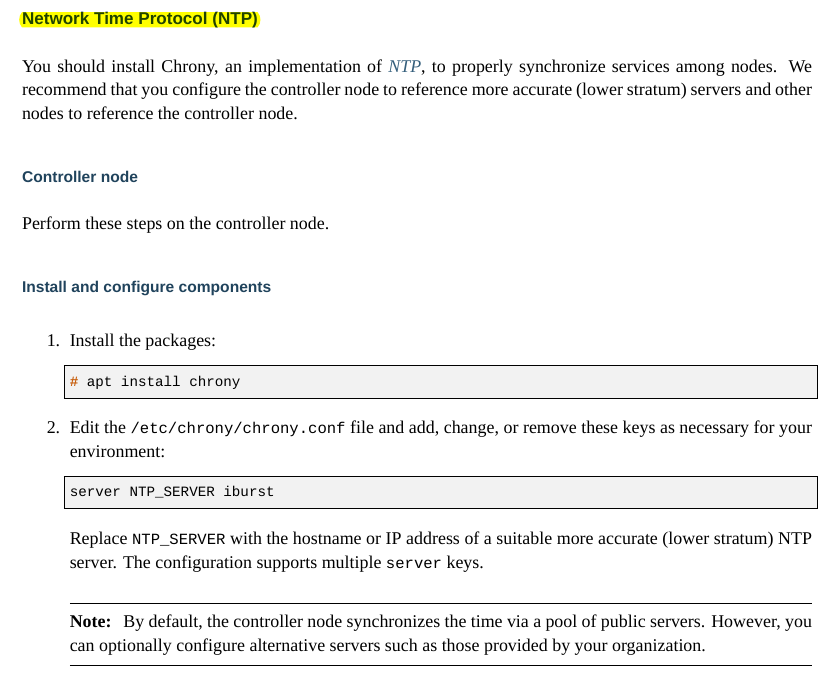
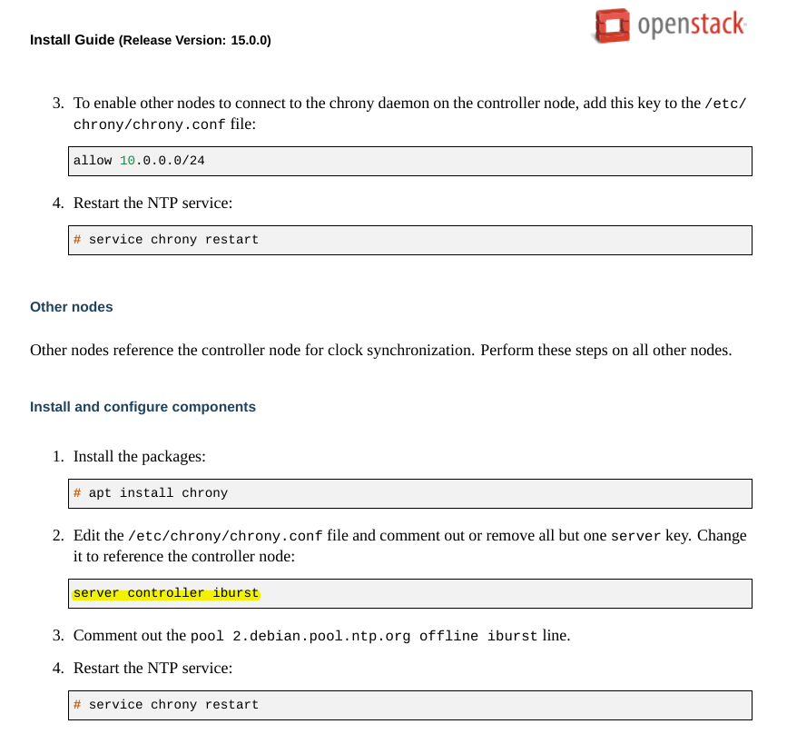

参考文档[Deploy_manual.md](https://github.com/open-estuary/packages/blob/master/openstack/doc/Deploy_manual.md)

## 准备工作
1 确保三块单板时间同步,参考


2 修改三块单板/etc/network/interfaces内容
```
改/etc/network/interfaces.d/*.cfg为/etc/network/interfaces.d/*
```
3 如果三块单板/etc/apt/source.list有linaro的源要注释掉
deb http://repo.linaro.org/debian/erp-16.12-stable/ jessie main
deb-src http://repo.linaro.org/debian/erp-16.12-stable/ jessie main

4 test-controller节点 ifup eth1

5 三个单板执行mkfs.ext4 /dev/sdb

6 需要在deploy机器的sudoquanx

7 mkdir openstack-deploy

8 cd openstack-deploy

9 git clone https://github.com/open-estuary/packages.git

10 cd packages

11 根据packages/openstack/config/target_machine_hosts内容配置三块单板的hostname

## 执行安装 

1 ./openstack/sh/setup_deployment_machine.sh root
root为三块单板的用户名

2 三块单板重启

3 git clone https://git.linaro.org/leg/sdi/openstack-ref-architecture.git openstack/openstack-ref-architecture

4 cp -r openstack/config/secrets openstack/openstack-ref-architecture/ansible

5 ./openstack/sh/deployment.sh	root

执行这步的时候要选择yes/no,全部选择no
遇到[SUDO]输入三块目标单板root用户的密码，默认root
遇到[<username> sudo]输入deploy主机的sudo密码


